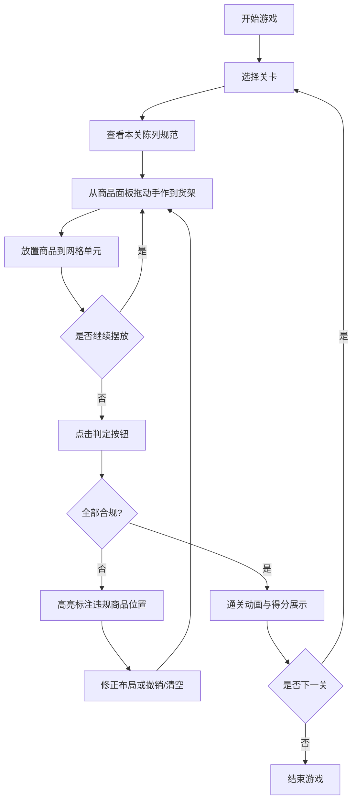

## 1. 产品概述

一款面向文创手作爱好者的货架陈列布局解谜小游戏，玩家通过拖拽手作成品到网格货架上完成陈列布局。游戏通过多关卡渐进式难度设计，寓教于乐地传递门店商品陈列规范知识。

- 核心价值：通过互动解谜形式，让玩家学习理解文创手作门店的商品陈列原则（大件放底层、小挂件挂上层、爆款放视觉中心）
- 目标用户：文创从业者、手作爱好者、门店陈列初学者

## 2. 核心功能

### 2.1 功能模块
1. **主游戏界面**：关卡选择、货架网格画布、商品组件面板、操作按钮组
2. **关卡系统**：9×8 网格（98关）和 3×8 网格（61关？此处理解为两种网格规格关卡），每关配置不同商品组合和陈列规范
3. **拖拽系统**：从组件面板拖动手作商品到网格货架，支持位置交换与移除
4. **合规判定引擎**：实时或手动校验商品位置是否符合关卡陈列规范，标注违规商品
5. **操作辅助**：单步撤销、一键清空、关卡提示、重置
6. **通关反馈**：全部合规后展示通关动画与得分

### 2.2 页面详情
| 页面名称 | 模块名称 | 功能描述 |
|---------|---------|---------|
| 游戏主界面 | 顶部信息栏 | 显示当前关卡名称、规范说明、操作按钮（撤销/清空/判定） |
| 游戏主界面 | 左侧商品面板 | 分类展示可拖拽的手作商品卡片（陶艺、香薰、爆款等） |
| 游戏主界面 | 中央货架画布 | 网格货架陈列区，支持拖放操作、高亮违规位置 |
| 游戏主界面 | 右侧规范提示 | 本关陈列规范清单、已完成/未完成项勾选状态 |
| 关卡选择弹窗 | 关卡列表 | 展示所有关卡、已通关标记、难度星级 |

## 3. 核心流程

## 4. 用户界面设计

### 4.1 设计风格
- **主色调**：暖木棕 `#8B6914`、奶油白 `#FFF8E7`、朱红点缀 `#C23B22`，模拟实体手作店的温暖氛围
- **次要色**：苔绿 `#556B2F`、陶瓷青 `#4F7942`
- **按钮风格**：圆角 12px，微立体阴影（木材质感），hover 有轻微上浮
- **字体**：标题用「ZCOOL 文悦明朝体」或「思源宋体」，正文用「思源黑体」
- **布局风格**：卡片式分区 + 拟物化货架木纹背景
- **图标风格**：Lucide + emoji 混合（🏺 陶艺、🌸 香薰、✨ 爆款、🎨 手作）

### 4.2 页面设计概览
| 页面名称 | 模块名称 | UI元素 |
|---------|---------|--------|
| 游戏主界面 | 顶部信息栏 | 关卡标签、规范卡片（带图标列表）、撤销/清空/判定按钮组 |
| 游戏主界面 | 左侧商品面板 | 分类标签页、商品卡片（emoji+名称+尺寸标识）、数量徽章 |
| 游戏主界面 | 中央货架画布 | 带木纹质感货架分层背板、网格单元虚线框、放置高亮、违规红色描边闪烁 |
| 游戏主界面 | 右侧规范清单 | 每条规范配勾选框、违规项红字标注、进度条百分比 |
| 通关弹窗 | 通关界面 | 彩带动画、得分数字、星级评价、下一关按钮 |

### 4.3 响应式
- 桌面端优先，固定画布尺寸 1100×720
- 平板端：左侧商品面板折叠为底部横滑条
- 移动端：两列布局切换为上下堆叠，货架横向滚动

### 4.4 动效细节
- 拖拽商品时：商品卡片半透明 + 跟随光标 + 目标网格高亮
- 违规标注：红色边框 2px + 脉冲动画（box-shadow 呼吸）
- 合规通过：网格单元渐变绿色高光 + 轻微弹跳
- 撤销操作：商品飞回原位的位移动画
