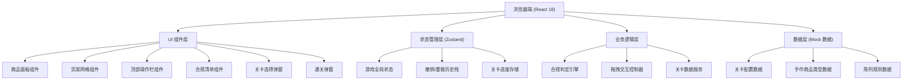

## 1. 架构设计



## 2. 技术选型说明

- **前端框架**：React 18 + TypeScript 5
- **构建工具**：Vite 6
- **样式方案**：Tailwind CSS 3 + CSS Variables 主题系统
- **状态管理**：Zustand 5（轻量，适合中小型游戏）
- **拖拽实现**：原生 HTML5 Drag & Drop API（无需额外依赖，支持自定义 drag image）
- **图标库**：lucide-react
- **路由**：react-router-dom 6（单页面无需路由，后续扩展关卡页可用）
- **后端**：无（纯前端游戏，Mock 数据 + localStorage 持久化进度）

## 3. 路由定义

| 路由 | 用途 |
|------|------|
| `/` | 游戏主界面（默认入口） |

（注：单页面应用，不启用复杂路由）

## 4. 数据模型

### 4.1 TypeScript 类型定义

```typescript
// 手作商品类型
type ItemCategory = 'pottery' | 'fragrance' | 'hot' | 'normal';
type ItemSize = 'large' | 'medium' | 'small';

interface CraftItem {
  id: string;
  name: string;
  emoji: string;
  category: ItemCategory;
  size: ItemSize;
  isHot: boolean;
}

// 网格单元格
interface GridCell {
  row: number;    // 从上到下 0..rows-1
  col: number;    // 从左到右 0..cols-1
  itemId: string | null;
  isViolation: boolean;
  violationMsg?: string;
}

// 陈列规则类型
type RuleType = 
  | 'large_on_bottom'       // 大件放底层
  | 'small_on_top'          // 小件放上层
  | 'hot_on_visual_zone'    // 爆款在视觉中心区
  | 'category_in_zone'      // 指定分类在指定区域
  | 'must_place_all';       // 所有商品必须上架

interface DisplayRule {
  id: string;
  type: RuleType;
  description: string;
  params?: Record<string, unknown>;
}

// 关卡配置
interface LevelConfig {
  id: number;
  name: string;
  rows: number;
  cols: number;
  gridSpec: '9x8' | '3x8';   // 两种网格规格
  difficulty: 1 | 2 | 3;
  items: Array<{ itemId: string; count: number }>;
  rules: DisplayRule[];
  visualZone?: { rows: [number, number]; cols: [number, number] }; // 视觉区范围
}

// 游戏状态
interface GameState {
  currentLevelId: number;
  grid: GridCell[][];            // rows x cols 二维数组
  inventory: Record<string, number>;   // 库存（未上架的商品计数）
  history: Array<{ grid: GridCell[][]; inventory: Record<string, number> }>;
  violations: Array<{ row: number; col: number; msg: string }>;
  isPassed: boolean;
  passedLevels: number[];
}
```

### 4.2 数据文件结构

```
src/data/
  ├── craftItems.ts        // 手作商品静态数据
  ├── levels.ts            // 关卡配置
  └── rulePresets.ts       // 陈列规则预设
```

## 5. 核心模块划分

### 5.1 合规判定引擎 `src/utils/validationEngine.ts`
- 入口函数：`validateLayout(level, grid)` → `Violation[]`
- 按规则类型分派到各校验器函数
- 校验器：
  - `checkLargeOnBottom()`：大件陶艺必须位于最下方 2 行
  - `checkSmallOnTop()`：小型香薰挂件必须位于最上方 2 行
  - `checkHotInVisualZone()`：爆款必须落在视觉中心矩形范围
  - `checkAllPlaced()`：库存必须全部为 0

### 5.2 拖拽控制器 `src/hooks/useDragDrop.ts`
- 实现原生 Drag & Drop 包装 Hook
- 管理拖拽源（商品面板）、放置目标（网格单元）
- 处理放置逻辑：更新网格 + 扣减库存 + 推入历史栈
- 支持网格间交换、网格回收到库存

### 5.3 Zustand Store `src/store/gameStore.ts`
- `placeItem(row, col, itemId)`：放置商品
- `removeItem(row, col)`：移除回库存
- `undo()`：从 history 栈弹出恢复
- `clearAll()`：清空网格 + 恢复库存
- `checkRules()`：触发合规判定
- `nextLevel()` / `selectLevel(id)`：关卡切换
- `persist`：用 localStorage 持久化 `passedLevels`

## 6. 组件结构

```
src/components/
  ├── TopBar.tsx                // 顶部栏：关卡名+规范摘要+操作按钮
  ├── ItemPanel/
  │   ├── ItemPanel.tsx         // 左侧商品面板容器
  │   └── ItemCard.tsx          // 单个可拖拽商品卡片
  ├── ShelfGrid/
  │   ├── ShelfGrid.tsx         // 货架网格画布主组件
  │   ├── GridCell.tsx          // 单个单元格（drop target）
  │   └── ShelfBackground.tsx   // 货架木纹背板（纯装饰）
  ├── RuleList.tsx              // 右侧规范清单（带勾选状态）
  ├── LevelSelector.tsx         // 关卡选择弹窗
  └── PassModal.tsx             // 通关庆祝弹窗
```
